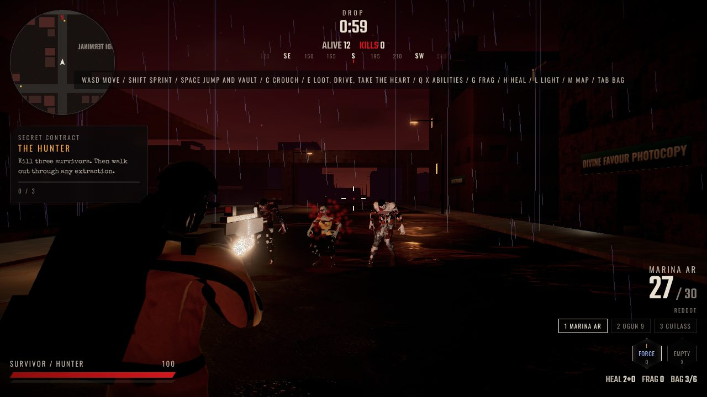
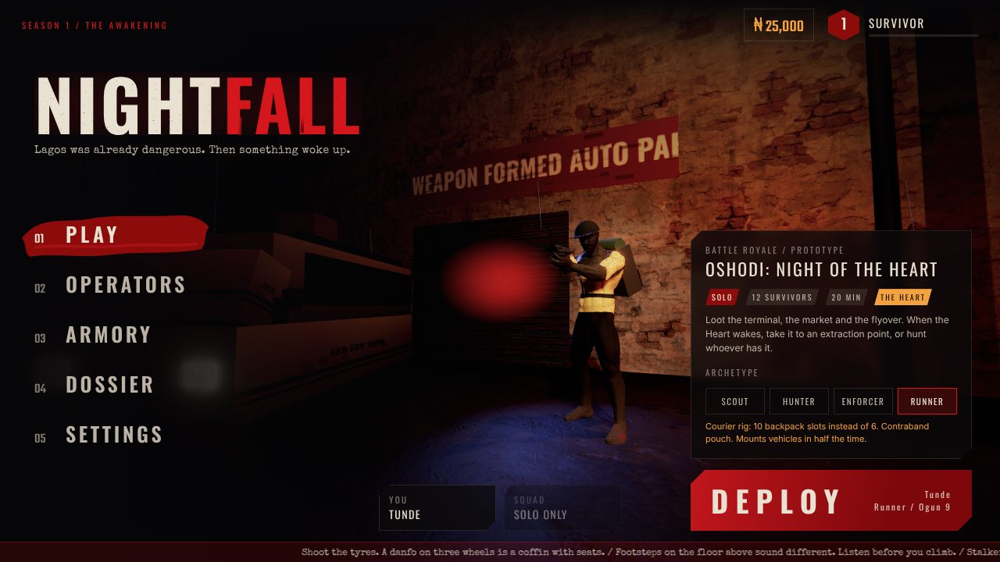
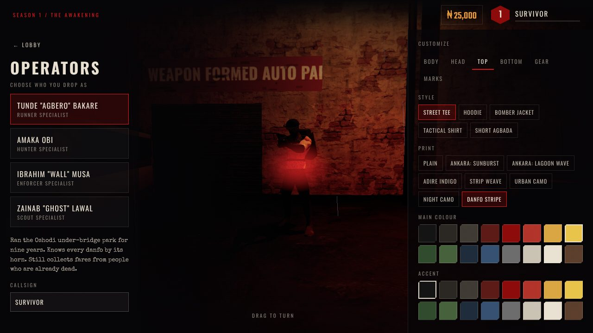
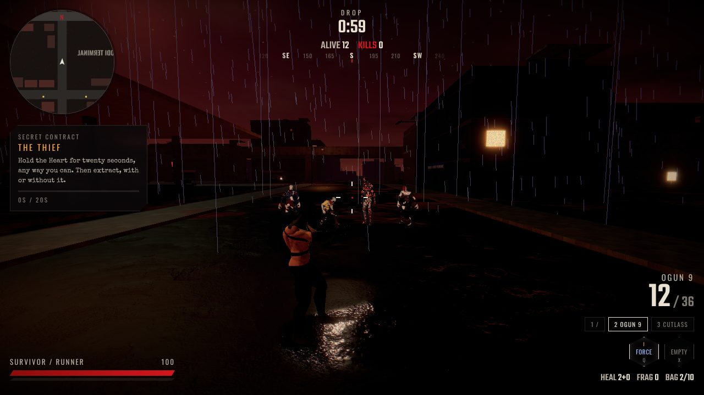
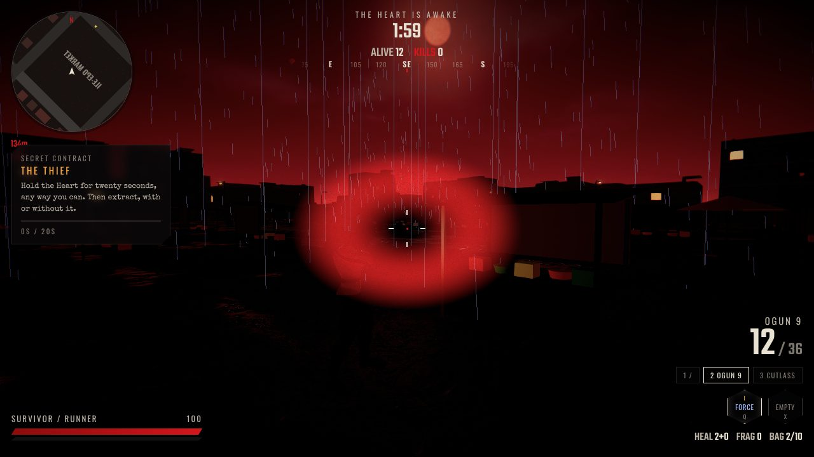
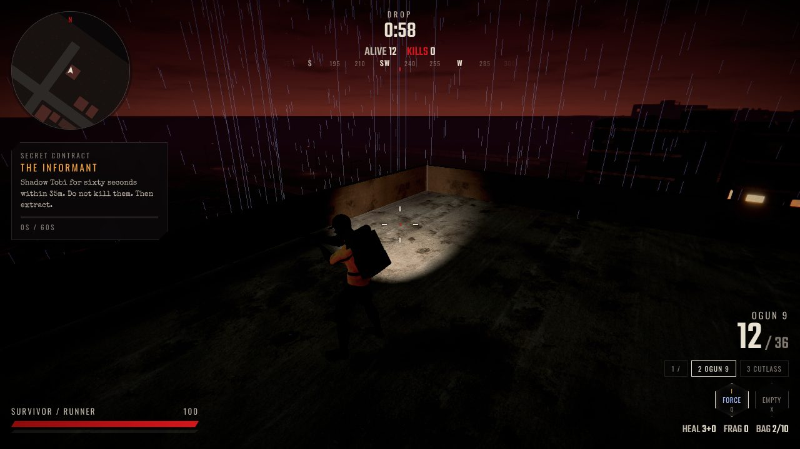
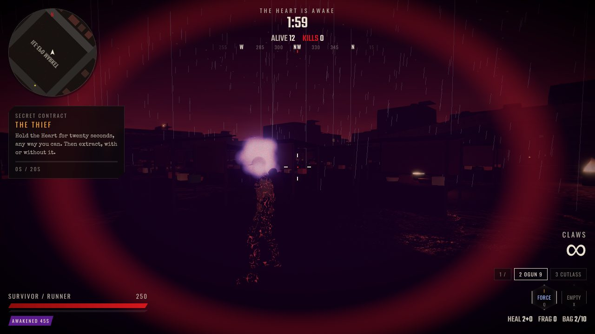

# NIGHTFALL

**Lagos was already dangerous. Then something woke up.**

A supernatural battle royale set in a dying Lagos. Twelve survivors drop into Oshodi at dusk, loot enterable multi storey buildings, hijack danfos and okadas, find supernatural abilities and fight the things that used to be their neighbours. Then the Heart wakes up under the city. Carry it out and you win. Everyone else is hunting you.

This repository holds the game bible and a playable browser vertical slice.

> **Also here: [LAGOS RUSH](rush/README.md)**, an arcade street racer on the real roads of Oshodi, with room based multiplayer for up to twelve cars. Its design and technical docs are in `docs/rush`.



| | |
|---|---|
|  |  |
|  |  |
|  |  |

More in `docs/screens`. These were captured with software rendering in a headless browser, so a real GPU looks sharper.

## Play it

```bash
cd game
npm install
npm run dev
```

Open the address Vite prints (usually http://localhost:5173). Click into the game to take mouse control. On a phone or tablet the touch controls appear automatically.

| Key | Action |
|---|---|
| WASD, Mouse | Move, look |
| Left and right mouse | Fire, aim |
| Shift | Sprint, or the danfo horn |
| Space | Jump, vault ledges, handbrake |
| C | Crouch |
| R | Reload |
| E | Loot, enter or leave vehicles, take the Heart |
| 1 2 3 | Weapons, or seats in a vehicle |
| Q, X | Abilities |
| G, H | Frag, heal |
| V | Awaken (needs an artifact) |
| L | Flashlight |
| M, Tab, Esc | Map, inventory, pause |

## What is in the slice

* A seeded 720 m Oshodi district: the terminal, Ile Epo Market, the flyover, the canal, Apapa Port, the lagoon and Airport Road, with about 220 buildings you can enter and climb to the roof.
* Realistic CC0 characters with full customization: build, skin tone, hair, beard, headgear, five top styles, Ankara, Adire and strip weave prints, trousers, shoes, plate carrier, backpack and face marks.
* Six weapons with eight attachments and eight finishes, all visible on the model.
* Four archetypes, including the Runner with a 10 slot courier rig.
* Force, Shadow and Metal abilities, Awakening into a monster, the Heart, three extraction points and six secret contracts.
* Okada, danfo and SUV with engine, tyre, fuel and body damage, hijacking and run overs.
* Crawlers, Hollow and Stalkers that freeze in your flashlight.
* Eleven bots that loot, climb buildings, fight, chase the Heart and extract.
* A "bloody darkness" look: blood moon, sodium lamps, wet streets, rain, fog, film grain and a horror grade, plus fully procedural audio.

## Repository

```
docs/                       game bible and production documents
  01_GAME_BIBLE.md
  02_ART_AND_UI_DIRECTION.md
  03_SYSTEMS_AND_BALANCE.md
  04_TECHNICAL_ARCHITECTURE.md
  05_LEVEL_DESIGN_OSHODI.md
  06_AUDIO.md
  07_ASSET_REGISTRY.md
  08_QA_AND_STATUS.md
  09_ROADMAP.md
game/                       the playable prototype (TypeScript, three.js, Rapier, Vite)
  src/sim                   authoritative simulation, bots, creatures, nav
  src/world                 procedural city
  src/render                renderer, characters, vehicles, weapons, effects
  src/ui                    lobby, customization, armory, HUD
  tests                     headless tests (npm test)
  tools/build-assets.mjs    asset pipeline for the CC0 source packs
  dev/chars.html            character and outfit lineup for art checks
```

## Commands

| Command | What it does |
|---|---|
| `npm run dev` | Development server |
| `npm run build` | Typecheck and production build into `game/dist` |
| `npm test` | City and simulation tests, about two minutes |

All third party assets are CC0 or open licensed. See `docs/07_ASSET_REGISTRY.md`.
